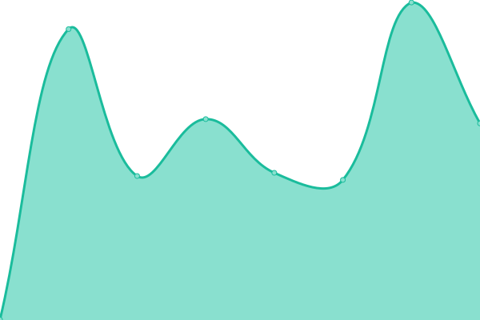
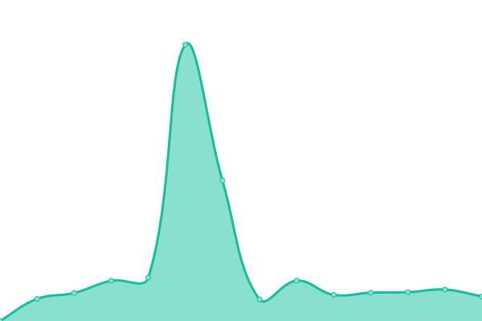
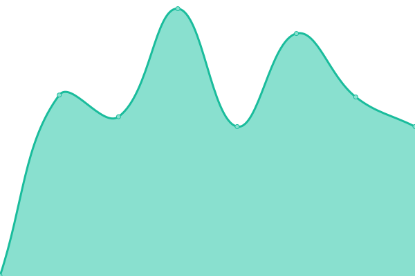

# [📈 Live Status](https://keywordnew.github.io/tallinn-watchtower): <!--live status--> **🟩 All systems operational**

This repository contains the open-source uptime monitor and status page for [Manil Chowdhury](https://manil.xyz), powered by [Upptime](https://github.com/upptime/upptime).

With [Upptime](https://upptime.js.org), you can get your own unlimited and free uptime monitor and status page, powered entirely by a GitHub repository. We use [Issues](https://github.com/keywordnew/tallinn-watchtower/issues) as incident reports, [Actions](https://github.com/keywordnew/tallinn-watchtower/actions) as uptime monitors, and [Pages](https://keywordnew.github.io/tallinn-watchtower) for the status page.

<!--start: status pages-->
<!-- This summary is generated by Upptime (https://github.com/upptime/upptime) -->
<!-- Do not edit this manually, your changes will be overwritten -->
<!-- prettier-ignore -->
| URL | Status | History | Response Time | Uptime |
| --- | ------ | ------- | ------------- | ------ |
|  [Tallinna Vesi](https://tallinnavesi.ee/) | 🟩 Up | [tallinna-vesi.yml](https://github.com/keywordnew/tallinn-watchtower/commits/HEAD/history/tallinna-vesi.yml) | 

 1044ms
     
 | 

<a href="https://keywordnew.github.io/tallinn-watchtower/history/tallinna-vesi">98.72%</a>
    

|  [Elektrilevi OÜ](https://www.elektrilevi.ee/en/avaleht) | 🟩 Up | [elektrilevi-o-ue.yml](https://github.com/keywordnew/tallinn-watchtower/commits/HEAD/history/elektrilevi-o-ue.yml) | 

 455ms
     
 | 

<a href="https://keywordnew.github.io/tallinn-watchtower/history/elektrilevi-o-ue">100.00%</a>
    

|  [Elisa Eesti AS](https://www.elisa.ee/) | 🟩 Up | [elisa-eesti-as.yml](https://github.com/keywordnew/tallinn-watchtower/commits/HEAD/history/elisa-eesti-as.yml) | 

 1216ms
     
 | 

<a href="https://keywordnew.github.io/tallinn-watchtower/history/elisa-eesti-as">100.00%</a>
    

|  [Põhja-Eesti Regionaalhaigla](https://www.regionaalhaigla.ee/) | 🟩 Up | [pohja-eesti-regionaalhaigla.yml](https://github.com/keywordnew/tallinn-watchtower/commits/HEAD/history/pohja-eesti-regionaalhaigla.yml) | 

 1313ms
     
 | 

<a href="https://keywordnew.github.io/tallinn-watchtower/history/pohja-eesti-regionaalhaigla">100.00%</a>
    

|  [Politsei- ja Piirivalveamet](https://www.politsei.ee/) | 🟩 Up | [politsei-ja-piirivalveamet.yml](https://github.com/keywordnew/tallinn-watchtower/commits/HEAD/history/politsei-ja-piirivalveamet.yml) | 

 922ms
     
 | 

<a href="https://keywordnew.github.io/tallinn-watchtower/history/politsei-ja-piirivalveamet">100.00%</a>
    

|  [Tallinna Linnatranspordi AS](https://www.tlt.ee/) | 🟩 Up | [tallinna-linnatranspordi-as.yml](https://github.com/keywordnew/tallinn-watchtower/commits/HEAD/history/tallinna-linnatranspordi-as.yml) | 

 1553ms
     
 | 

<a href="https://keywordnew.github.io/tallinn-watchtower/history/tallinna-linnatranspordi-as">98.47%</a>
    

|  [Monese](https://www.monese.com) | 🟩 Up | [monese.yml](https://github.com/keywordnew/tallinn-watchtower/commits/HEAD/history/monese.yml) | 

 290ms
     
 | 

<a href="https://keywordnew.github.io/tallinn-watchtower/history/monese">99.84%</a>
    

<!--end: status pages-->

[**Visit our status website →**](https://keywordnew.github.io/tallinn-watchtower)

## 📄 License

- Powered by: [Upptime](https://github.com/upptime/upptime)
- Code: [MIT](./LICENSE) © [Manil Chowdhury](https://manil.xyz)
- Data in the `./history` directory: [Open Database License](https://opendatacommons.org/licenses/odbl/1-0/)
